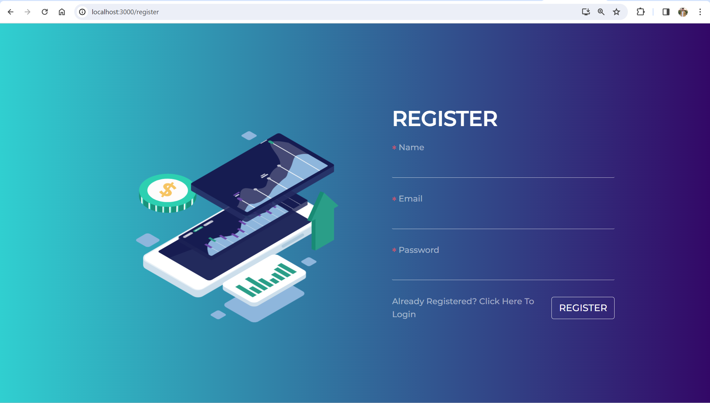
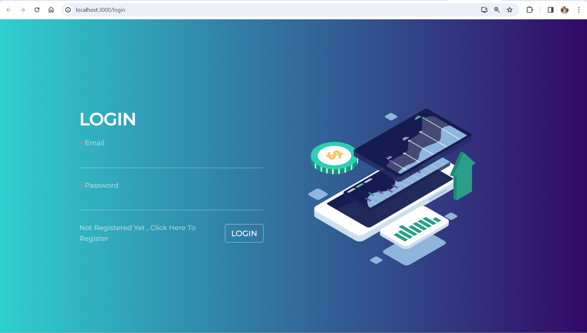
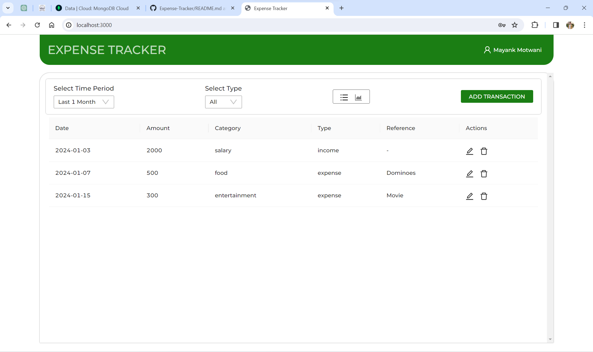
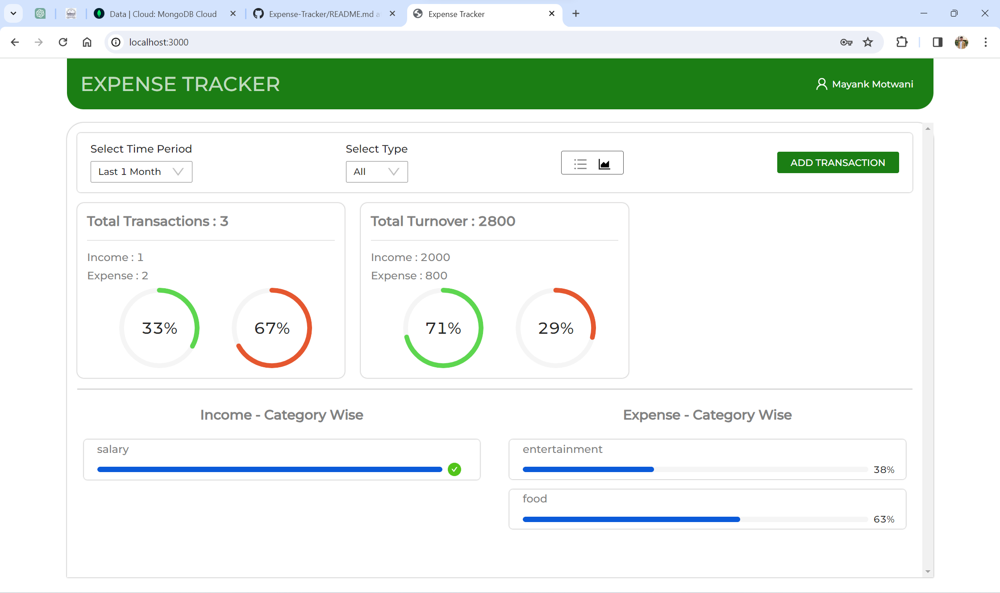

# Expense Tracker
This web application empowers users to track their income and expenditures through an interactive and responsive dashboard. It facilitates the categorization of transactions into various segments such as salary, freelance, food, travel, medical, education, etc. The platform not only presents colorful and dynamic visualizations but also offers insights, enabling users to analyze their financial activities and gain a comprehensive understanding of their spending patterns.

## Tech Stack
The front-end is crafted using React and the Ant Design JavaScript libraries, ensuring a premium appearance and a responsive user interface.
<br />
On the back-end, the Node.js platform along with the Express framework has been used. MongoDB (Atlas) is employed for database infrastructure, contributing to the application's robustness.

## Screenshots





## Getting Started
### Installation
Download the repository and then open aterminal in the project directory. Run the following commands to install the dependencies for the back-end and the front-end.
```
npm intall
```
and
```
npm run client-install
```
**Note:** To use your own MongoDB (Atlas) database cluster, obtain the connection string and paste it at line ```3``` of the ```dbConnect``` file.
### Running
If you're using VSCode, you can split the terminal and execute both the following commands in each terminal.
1. Start the server
```
npm run server
```
2. Start the client
```
npm run client
```
You can also use the ```npm start``` command to start both the server and the client.
<br />
The application is running and opens in your browser. 🎉
<hr />
